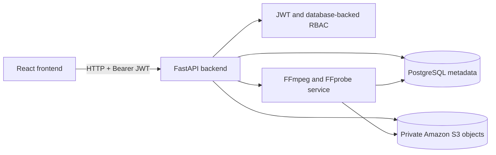

# ClipMind AI Module 1

ClipMind AI is a role-aware video platform foundation. Module 1 provides account registration, JWT login, role-based access control, cloud-backed video upload, video libraries, upload history, and basic FFmpeg technical processing.

AI transcription, summarization, and key-moment detection are intentionally not implemented yet.

## 1. Project Overview

Users sign in to a workspace based on their role. Creators and educators upload videos, learners browse completed videos, and administrators monitor platform activity. FastAPI owns authentication, authorization, validation, storage coordination, and database access. React provides the user interface.

## 2. Problem Statement

Video workflows need a secure place to upload media, keep metadata, track processing status, and restrict information by role. Module 1 establishes those reliable foundations before AI capabilities are added.

## 3. Objectives

- Register users and authenticate them with JWTs.
- Enforce permissions in the backend.
- Provide role-specific dashboards and protected routes.
- Store video binaries in private Amazon S3 storage.
- Store only video metadata and object keys in PostgreSQL.
- Track upload and processing events.
- Use FFmpeg/FFprobe for basic technical validation and duration extraction.
- Provide documented, testable HTTP APIs.

## 4. User Roles

| Role | Module 1 access |
|---|---|
| Content Creator | Upload videos, manage owned videos, view owned upload history, view owned processing status |
| Learner | View completed videos available for learning |
| Educator | Upload and manage owned educational videos, view owned status |
| Administrator | View platform videos, upload, monitor platform history and status, access all RBAC verification endpoints |

## 5. System Architecture



The browser never receives database credentials, S3 credentials, or private object keys. The backend is the final security boundary; frontend route protection is only a user-experience layer.

## 6. Database Schema

The main tables are:

- `roles`: allowed role names.
- `users`: identity, normalized email, password hash, and role foreign key.
- `videos`: owner, filename, S3 object key, MIME type, size, duration, status, and timestamps.
- `upload_history`: immutable-style video lifecycle events with status, timestamp, and notes.

Relationships:

```text
Role 1 ---- many User 1 ---- many Video 1 ---- many UploadHistory
```

Video binaries are never stored in PostgreSQL. `videos.storage_key` points to the private S3 object.

## 7. Folder Structure

```text
ClipMind-AI/
├── backend/
│   ├── app/
│   │   ├── auth/                 # JWT, passwords, dependencies, permissions
│   │   ├── models/               # SQLAlchemy models
│   │   ├── routes/               # auth, RBAC, videos, upload history
│   │   ├── schemas/              # Pydantic API contracts
│   │   └── services/             # user, storage, status, FFmpeg logic
│   ├── tests/                    # backend API and service tests
│   ├── requirements.txt
│   └── .env.example
├── frontend/
│   ├── src/
│   │   ├── components/           # shell and protected routes
│   │   ├── features/auth/        # authentication context
│   │   ├── services/             # HTTP API client
│   │   ├── types/                # frontend API types
│   │   └── styles/               # global styles
│   └── package.json
├── database/                     # database notes and future migrations/seeds
├── docs/                         # architecture, API, database, UI docs
└── README.md
```

## 8. Technology Stack

- Frontend: React, TypeScript, Vite, React Router, Lucide icons.
- Backend: Python, FastAPI, Pydantic, SQLAlchemy.
- Database: PostgreSQL.
- Authentication: signed JWT access tokens, password hashing with Argon2 through `pwdlib`.
- Object storage: Amazon S3 through `boto3`.
- Media tooling: FFmpeg and FFprobe.
- Testing: pytest, FastAPI TestClient, SQLite test databases, Vitest setup in the frontend.

## 9. Installation Requirements

- Python 3.12 or a compatible recent Python version.
- Node.js and npm.
- PostgreSQL 14+ recommended.
- An S3 bucket with private access for real uploads.
- FFmpeg and FFprobe installed on the backend host and available on `PATH`, or configured with absolute paths.
- Git.

## 10. Environment Variables

Copy `backend/.env.example` to `backend/.env`. Never commit `.env` or real credentials.

| Variable | Purpose |
|---|---|
| `DB_USER`, `DB_PASSWORD`, `DB_HOST`, `DB_PORT`, `DB_NAME` | PostgreSQL connection |
| `JWT_SECRET_KEY` | Secret used to sign access tokens |
| `JWT_ALGORITHM` | JWT signing algorithm, normally `HS256` |
| `ACCESS_TOKEN_EXPIRE_MINUTES` | Token lifetime |
| `MAX_VIDEO_SIZE_BYTES` | Upload limit, default 500 MB |
| `S3_BUCKET`, `S3_REGION`, `S3_PREFIX` | Private object storage location |
| `S3_ENDPOINT_URL` | Optional S3-compatible endpoint |
| `AWS_ACCESS_KEY_ID`, `AWS_SECRET_ACCESS_KEY`, `AWS_SESSION_TOKEN` | Optional local credentials; prefer IAM roles in deployment |
| `FFMPEG_BINARY`, `FFPROBE_BINARY` | FFmpeg executable names or paths |
| `FFMPEG_TIMEOUT_SECONDS` | Processing command timeout |

Credentials are read server-side through environment settings. They are not hardcoded, returned by APIs, or sent to the browser.

## 11. Backend Setup

```powershell
cd backend
python -m venv .venv
.\.venv\Scripts\Activate.ps1
python -m pip install -r requirements.txt
Copy-Item .env.example .env
```

Fill in PostgreSQL, S3, JWT, and FFmpeg values, then start the API:

```powershell
python -m uvicorn app.main:app --reload
```

API health: `http://127.0.0.1:8000/`  
Swagger UI: `http://127.0.0.1:8000/docs`

## 12. Frontend Setup

```powershell
cd frontend
npm install
npm run dev
```

The Vite development server normally runs at `http://127.0.0.1:5173`. Set `VITE_API_URL` if the backend is hosted elsewhere.

## 13. Database Setup

Create an empty PostgreSQL database and configure the `DB_*` variables. The SQLAlchemy models define `roles`, `users`, `videos`, and `upload_history`. The current repository contains database documentation placeholders rather than an Alembic migration runner, so production schema migration automation is not part of Module 1. Backend tests create an isolated SQLite schema automatically.

For a development database, run the project’s database setup procedure used by your team before starting the API, then verify:

```powershell
cd backend
python .\scripts\test_database_connection.py
```

## 14. Authentication Flow

1. The client sends `POST /auth/register` with name, email, password, confirmation, and role.
2. The client sends `POST /auth/login` with email and password.
3. FastAPI returns a signed access token and role summary.
4. The frontend stores the token in browser local storage and calls `GET /auth/me` to restore the current user.
5. Protected requests send `Authorization: Bearer <token>`.
6. Missing, invalid, expired, or unknown-user tokens return `401`.

## 15. Role-Based Access Control

The frontend hides routes and redirects users who do not match the route role. The backend independently loads the current database role and checks permissions on every protected request. Changing a URL cannot bypass backend authorization.

## 16. Video Upload Workflow

1. Creator, educator, or administrator selects a file in the React upload page.
2. The frontend checks extension, MIME type, emptiness, and the 500 MB default limit.
3. FastAPI repeats validation as the authoritative check.
4. The file is uploaded to S3.
5. PostgreSQL stores metadata and the object key with status `UPLOADED`.
6. An `UPLOADED` history event is recorded.
7. `POST /videos/{video_id}/process` can begin the FFmpeg workflow.

## 17. Cloud Storage Workflow

Video bytes go to a private S3 object at `videos/{user_id}/{video_id}.extension`. PostgreSQL stores only the object key and metadata. Upload failures return a storage error without creating metadata; database failures attempt to delete the already-uploaded object. Server-side AES-256 encryption is requested for uploads.

## 18. FFmpeg Workflow

The dedicated FFmpeg service downloads the private object to a temporary file, uses FFprobe to extract duration, and runs FFmpeg with a null output to validate the media. Status moves from `UPLOADED` to `PROCESSING`, then `COMPLETED` or `FAILED`; every transition creates an upload-history event. The service logs start, success, and failure. Its completed output and metadata are the future handoff point for AI workers, but no AI processing exists in Module 1.

## 19. API Endpoints

| Method | Endpoint | Purpose |
|---|---|---|
| `POST` | `/auth/register` | Register an account |
| `POST` | `/auth/login` | Issue a JWT |
| `GET` | `/auth/me` | Read the authenticated profile |
| `GET` | `/rbac/...` | Verify role permissions |
| `POST` | `/videos/upload` | Upload a video to S3 |
| `GET` | `/videos/` | List role-visible videos |
| `GET` | `/videos/history` | Creator-owned upload history |
| `GET` | `/admin/upload-history` | Administrator platform history |
| `GET` | `/videos/status` | Read current processing status |
| `PATCH` | `/videos/{video_id}/status` | Apply a valid status transition |
| `POST` | `/videos/{video_id}/process` | Run basic FFmpeg processing |

Full request bodies, permissions, status codes, and negative cases are documented in [docs/api/README.md](docs/api/README.md).

## 20. Postman Testing

Import [ClipMind-Registration.postman_collection.json](docs/api/ClipMind-Registration.postman_collection.json). Set `baseUrl`, role account credentials, and local file variables for valid, invalid, and oversized fixtures. Run login requests before protected requests; scripts save JWTs and the valid upload request saves `videoId`. The collection covers positive and negative scenarios for all Module 1 APIs.

Repeatable local validation is:

```powershell
cd backend
python -m pytest
```

## 21. GitHub Branching Strategy

- `main`: stable, reviewed Module 1 baseline.
- `develop`: integration branch for completed work.
- `feature/<short-name>`: one focused feature or documentation change.
- `fix/<short-name>`: bug fixes and regressions.

Open pull requests from feature or fix branches into `develop`, run tests and builds, then merge reviewed releases into `main`. Keep commits focused and do not commit `.env`, cloud credentials, generated secrets, or large video fixtures.

## 22. Run the Project Locally

1. Start PostgreSQL and create/configure the development database.
2. Configure `backend/.env` from `.env.example`.
3. Install FFmpeg/FFprobe and configure S3 credentials or an IAM role.
4. Start FastAPI in one terminal:

	```powershell
	cd backend
	.\.venv\Scripts\Activate.ps1
	python -m uvicorn app.main:app --reload
	```

5. Start React in a second terminal:

	```powershell
	cd frontend
	npm install
	npm run dev
	```

6. Open the frontend, register a role account, sign in, and use the role workspace.
7. Run backend tests before submitting changes:

	```powershell
	cd backend
	python -m pytest
	```

## Current Scope

Module 1 ends at secure upload, metadata persistence, history, status tracking, video listing, and basic FFmpeg validation. Transcription, AI summarization, key-moment detection, classroom management, and production migration automation are not implemented.

## Documentation Index

- [Architecture](docs/architecture/README.md)
- [Database design](docs/database/README.md)
- [API and Postman testing](docs/api/README.md)
- [UI and user flows](docs/ui/README.md)
- [Backend setup](backend/README.md)
