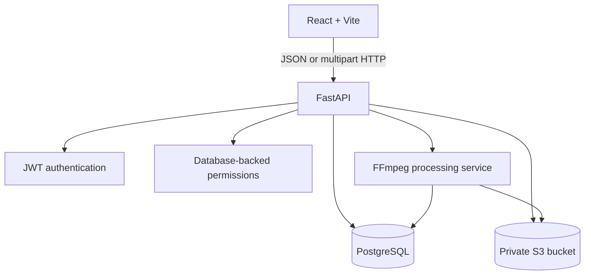

# Architecture Documentation

Document the layered ClipMind AI architecture here.

Expected topics:


# ClipMind AI Architecture

## Purpose

Module 1 is a browser-based React application backed by a FastAPI HTTP API. PostgreSQL stores structured metadata, Amazon S3 stores private video binaries, and a dedicated FFmpeg service extracts technical metadata and validates media.

## Components



### Frontend

The React frontend uses React Router for protected navigation and an authentication context for the current user and JWT. The API client adds bearer tokens to protected requests and exposes typed response models.

### Backend

FastAPI routes receive HTTP requests, validate request data, apply authorization dependencies, and call service modules. SQLAlchemy sessions provide PostgreSQL access. Business logic for user operations, cloud storage, status transitions, and FFmpeg is kept outside route handlers.

### Security boundary

The browser protects usability with role-based routes, but the backend is authoritative. Every protected request validates the JWT and reloads the user role from the database. S3 and database credentials remain server-side.

## Main Data Flows

### Authentication

```text
React -> POST /auth/login -> FastAPI validates password -> JWT
React -> GET /auth/me with JWT -> current user and role
```

### Upload

```text
React multipart form -> FastAPI validation -> S3 object
S3 success -> PostgreSQL Video metadata + UPLOADED history event
```

### Processing

```text
POST /videos/{id}/process -> PROCESSING event
S3 download -> temporary file -> FFprobe duration -> FFmpeg validation
success -> COMPLETED event; failure -> FAILED event
```

## Future Boundary

The completed video and technical metadata are the handoff contract for future transcription, summarization, and key-moment workers. Those capabilities are outside Module 1.
